<div style="background-color: #0F0F0F; padding: 10px;">

<!-- <div align="center">
  <p style="text-align: center; text-decoration: none; font-size: 2em;">A software engineer's guide to making friends</p>
</div> -->
<div align="center">
  <h1 style="font-size: 38px; text-decoration: none;">Hosting your own discord LLM Bot</h1>

<div style="width: 60%; text-align: center;">
    <!--  -->
  https://discord.gg/9hcr7rTk36
</div>
</div>

<div align="center">

<!-- [](https://www.youtube.com/watch?v=O6oTwbE0kyU) -->
</div>

<!-- 
<div style="display: flex; align-items: center;"> -->
<!-- <div style="width: 40%;"> -->


<h1 align="center">Table of Content</h1>
</br>

- [Overview](#overview)
- [What You Will Need](#what-you-will-need)
- [Create Discord Bot](#discord-set-up)
    * [1. Go To Discord Developer Console](#discord-application-developer)
    * [2. Create New Application](#create-discord-bot)
    * [3. Set Install Link](#set-install-link)
    * [4. Set Bot Settings](#set-bot-settings)
    * [5. Set Content Intent](#set-content-intent)
    * [6. Get Bot Token](#get-bot-token)
    * [7. Add Bot To Server](#add-bot-to-server)
- [Fireworks API key](#fireworks-api-key)
- [Run The Bot](#the-repo)
    * [Clone or Download the Repo](#clone-repo)
- [Set .env File](#bot-token-in-env)
- [Run The Bot](#run-the-bot)
- [Configuration Notes](#configuration-notes)
- [TLDR](#tldr)


</div>
<!-- </div> -->

<div style="background-color: #0F0F0F; padding: 10px;">

<a id="overview"></a>
<h1 align="center">Overview</h1>

<!-- ## Overview -->
This repo will allow users to set up their own personalized AI Character in discord.
By hosting your own bot you will have full control over how the LLM behaves

Building your bot requres a bit of set up but I will try to make it as easy as possible. 

NOTE: In this guide I will be using fireworks.ai api to run text generations. If you wish to use a different API or host the model locally you will need to alter the discord_llama.py generation method.
Fireworks is not free but this repo is designed the keep the costs low as possible (I ran it 24/7 on my own server and the cost so far over two weeks has been $1.50). All the rate limiters are configurable so you can easily get the cost lower if you lower the max_context_size and max_bot_response_count_per_interval (see configuration notes)

If you want to run your own model all you have to do is change the completion_generator.py code.


<!-- </div> -->

<div style="background-color: #0F0F0F; padding: 10px;">
<h1 style="font-size: 24px; margin-top: 0.5em; margin-bottom: 0.5em; line-height: 1.1;" align="left">What You Will Need</h1>

<!-- ## Overview -->

<p style="font-size: 18px; font-weight: bold; margin-top: 0.0em; margin-bottom: 0.0em;">The Basics</p>

* Python (You can just run the run.bat in the main directory if you don't have python)
* [Discord Bot and Bot token](#discord-application-developer)
* [Fireworks.ai API Key](#fireworks-api-key)

Initialize settings by running the lazy_ui.py script
Windows users can just run run.bat 

1. Place both keys in the designated input fields. 
2. Save the settings
3. Then you can either start the bot from the UI or navigate to the src folder and run python bot.py settings/settings.json

or to run on cloud, configure _upload.sh (linux terminal script) and just run that script

<p style="font-size: 18px; font-weight: bold; margin-top: 0.0em; margin-bottom: 0.0em;">For Perminant Setup</p>

* 100% uptime server (Cloud provider or your own server device like raspberry pi or something)
* Docker (or just scp all the files and download the requirements manually)

##

<a id="discord-set-up"></a>

<h1 style="font-size: 24px;
    margin-top: 0.5em;
    margin-bottom: 0.5em;
    line-height: 1.1;"
    align="center">Create Discord Bot</h1>
    
<!-- # Create Discord Bot -->

<a id="discord-application-developer"></a>
### 1: Go to https://discord.com/developers/applications

<a id="create-new-application"></a>

### 2: Click "New Application"
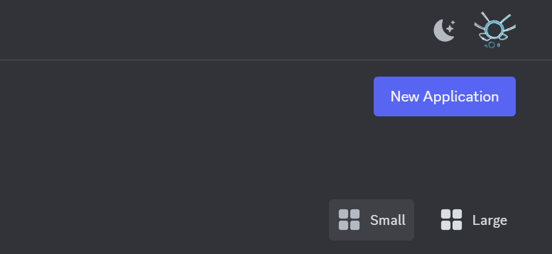

<a id="set-install-link"></a>

### 3: Set Install ink to None
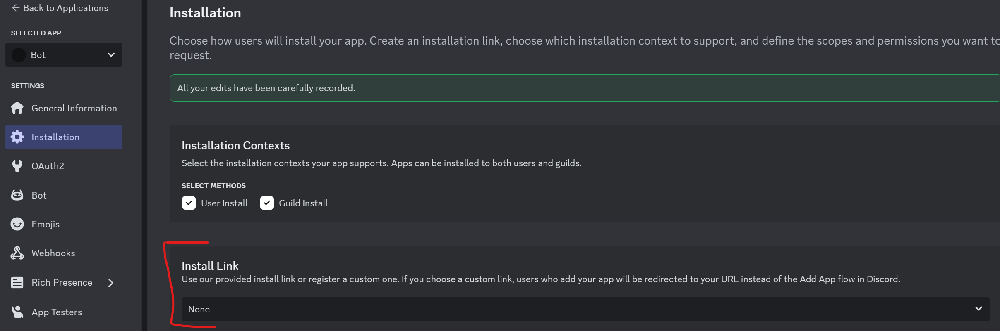

<a id="set-bot-settings"></a>

### 4: Set Bot Image, Name, and Set Toggle Public Off
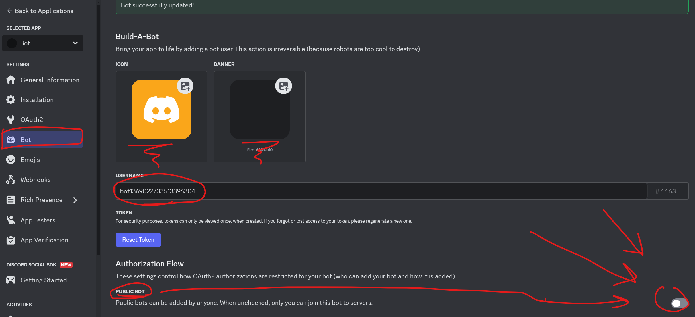

<a id="set-content-intent"></a>

### 5: Set Message Content Intent
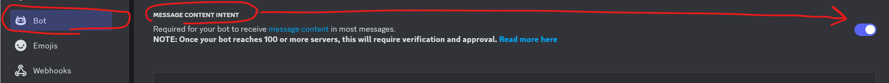

<a id="get-bot-token"></a>

### 6: Get Bot Token ([You can place this in the bot_token field in the UI or in the src/.env file, I will show later](#bot-token-in-env))
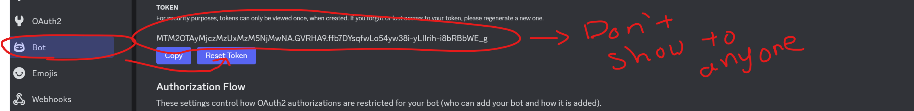

<a id="add-bot-to-server"></a>

### 7: Add Bot To Server 
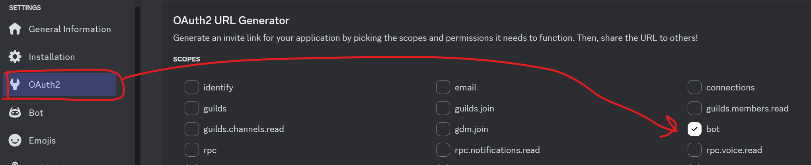
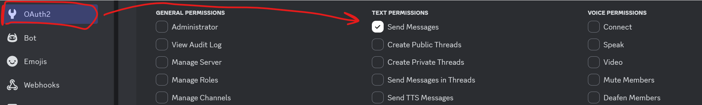
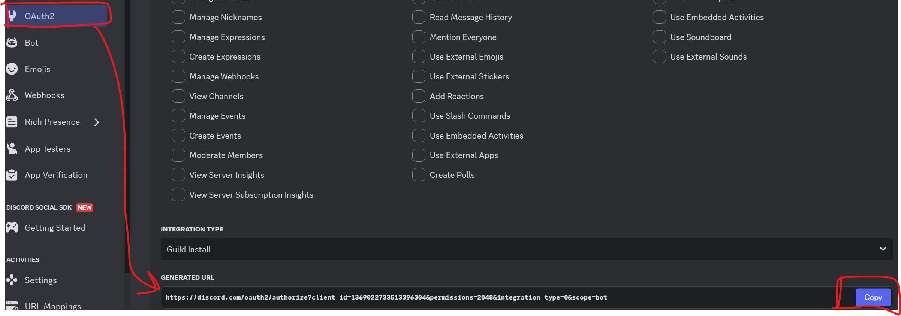
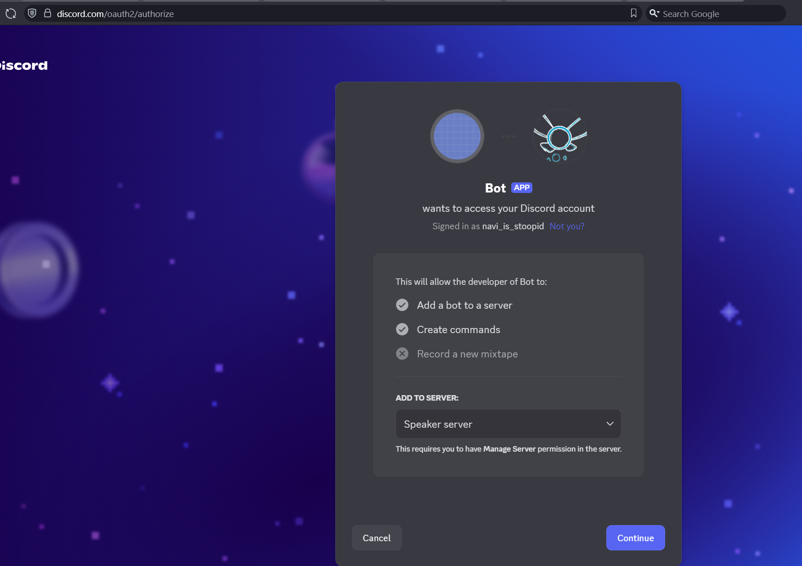


<a id="fireworks-api-key"></a>

# Fireworks API key

https://github.com/navi-is-hardworking/fire_chat?tab=readme-ov-file#TTT-key


<a id="the-repo"></a>
<h1 style="font-size: 32px;
    margin-top: 0.5em;
    margin-bottom: 0.5em;
    line-height: 1.1;"
    align="center">Running The Bot</h1>

<a id="clone-repo"></a>

## 1.Clone or Download the repo

```
// If you are comfortable with command line just pull
git clone https://github.com/navi-is-hardworking/NaviDiscordBot.git
```
Otherwise you can download and unzip (not recommended)
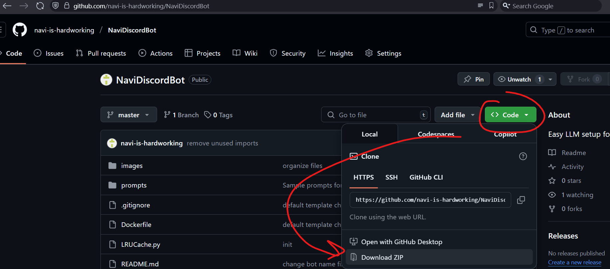


<a id="bot-token-in-env"></a>

## 2. Save keys via UI file or set in .env file
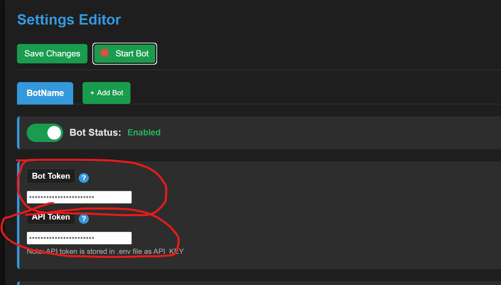

## 3. Get Channel ID where the bot will speak

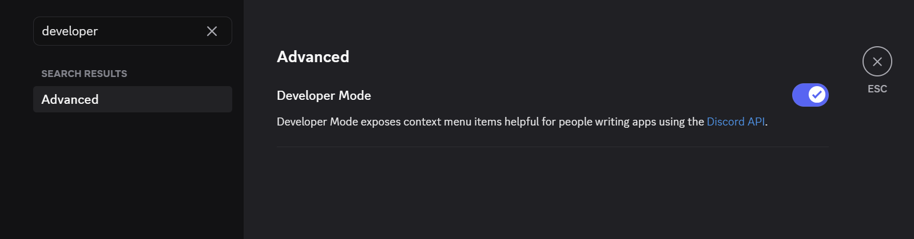

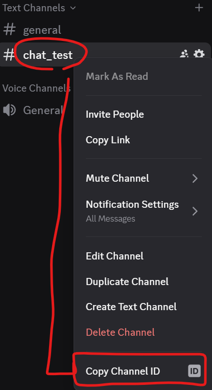

## 4. place the channel ids you want the bot to talk in into the settings.json file or use the lazy_ui.py

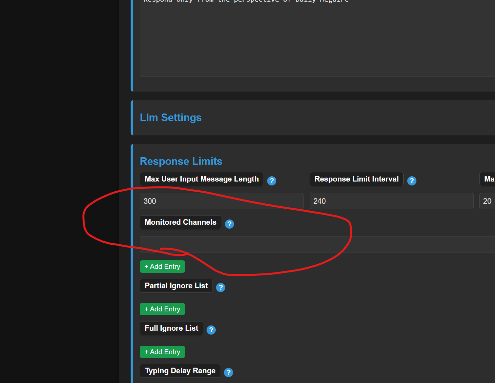

### Note
You can add multiple channels to the bot but the bot will share the same context across all of them. If you want them to have different context you will need to add another bot in the UI. The UI name does not affect the AI.

<!-- </div> -->

## How to run

Set configurations via 

```
python lazy_ui.py

// make sure to save after updating settings

// then run the main bot.py file from

cd src
python bot.py

```

<!-- ## Change bot name
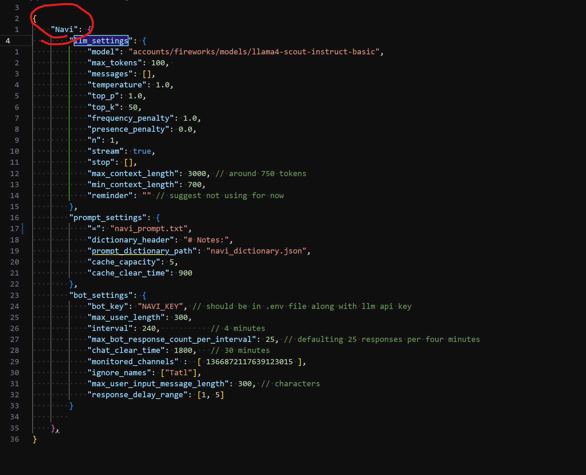 -->

<!-- ## Change prompt
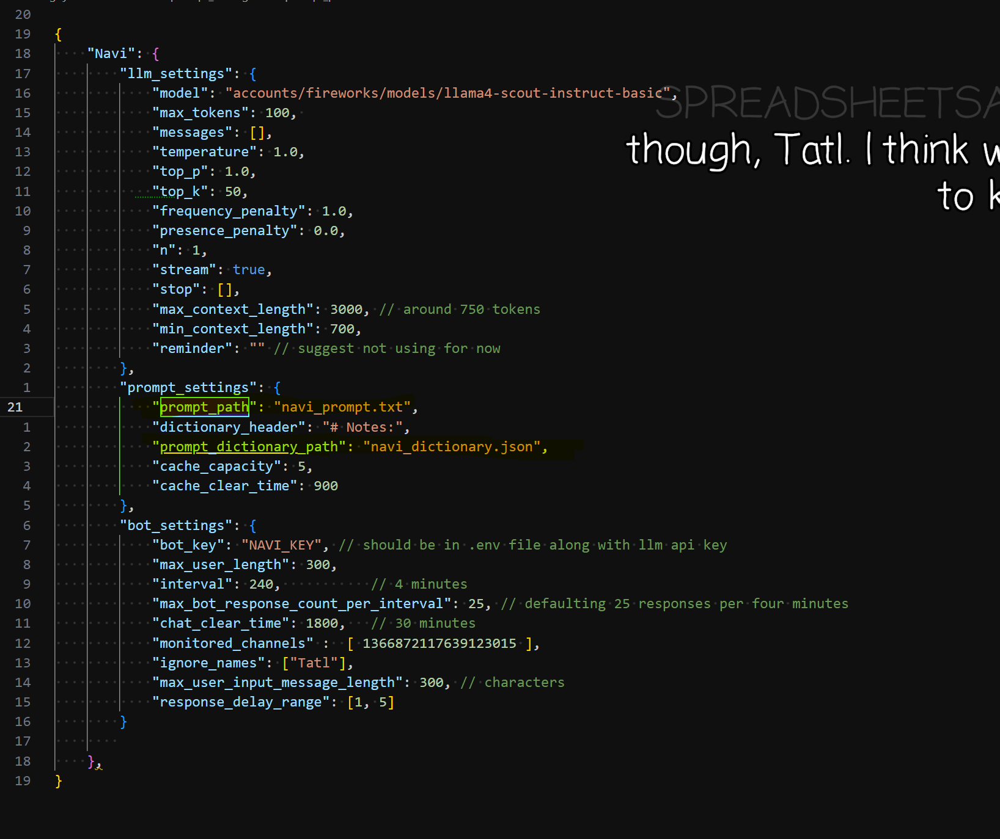
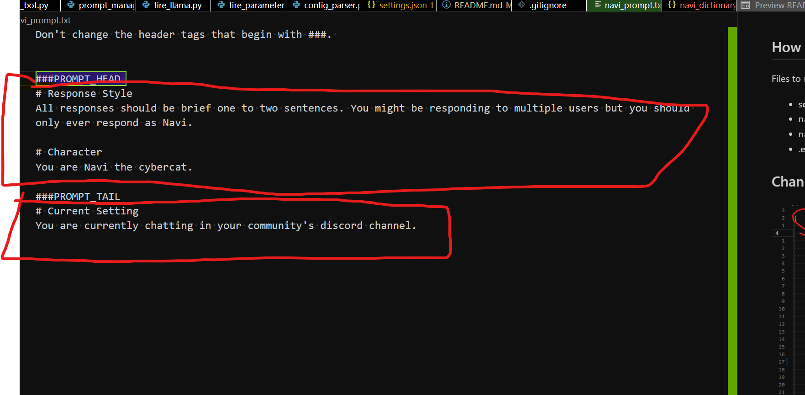 -->

## Change changing prompt and dictionary paths

<a id="run-the-bot"></a>
<h1 style="font-size: 32px;
    margin-top: 0.5em;
    margin-bottom: 0.5em;
    line-height: 1.1;"
    align="center">Run The Bot</h1>

### To run from windows locally
```
Just run run.bat
```


### To run with UI
```
python -m venv venv
source venv/Scripts/activate 
python lazy_ui.py
```

### To run without UI
```
cd src
python bot.py setting/settings.json
```

### To run on aws (requires Docker) (configure paths in _upload.sh)
```
./_upload.sh
```


<a id="configuration-notes"></a>
<h1 style="font-size: 32px;
    margin-top: 0.5em;
    margin-bottom: 0.5em;
    line-height: 1.1;"
    align="center">Configuration Notes</h1>

## ** LLM Model parameters

```    
max_tokens                -> The maximum length of the models response. 1 token is roughly 4 letters/characters
messages                  -> initial messages, can just leave empty
temperature               -> Regulates the randomness in token selection during text generation. Higher values means more diversity in token selection but setting it too high can result in gibberish outputs. (safe range from 0 to 1)
top_p                     -> Filters token selection range based on probability. A value of 1 means all tokens in the vocabulary are considered for selection based on their probabilities. Lower values restrict selection to only the most likely tokens.
top_k                     -> Limits token selection to only the top k most probable tokens at each generation step. With value 50, the model considers only the 50 highest probability tokens when deciding what to generate next, discarding all other possibilities.
frequency_penalty         -> Reduces token repetition, scales up based on the number of times a token has occured the context
presence_penalty          -> Reduces the likelyhood a token will be selected if it has already occured in the context. (Unlike frequency penalty it only cares if the token has occured at all in the text, rather than the number of occurences)
n                         -> number of responses (mainly for testing, wastes tokens in most cases)
stream                    -> a
stop                      -> List of tokens that will cause the generation to stop when reached. (You can leave this empty most of the time in chat models. But it can be very useful when using completion models. For example, you can set closing quotes " as the stop token to get the model to finish the dialogue.)

max_context_length        -> Max CHARACTER count in context NOT including prompt length. Manage costs keeping in mind that 4 characters is roughly equal to one token.
min_context_length        -> Truncates context length after periods of inactivity 

prompt_head               -> instructions for the model
prompt_tail               -> instructions for the model
dictionary_cache          -> Would normally be vdb but just using simple dictionary for important memories so it can run on aws micro
cache_capacity            -> number of cached memories that can be stored at once
cache_clear_time          -> max duration a memory will exist in context before being removed
reminder                  -> experemental: does not work well on some models. Appends to end of context before sending.

```

<a id="bot-configurations"></a>
## ** Bot Configurations

```
max_user_input_message_length        -> will truncate user messages that are too long
max_bot_response_count_per_interval  -> to prevent oveuse. Number of times the llm can respond per interval length
interval                             -> interval length for max_bot_response_count_per_interval time in seconds
chat_clear_time                      -> will truncate chat to min_context_length set in model parameters
channels                             -> channels that it will respond
ignore_names                         -> names to ignore (like other bots)
response_delay_range                 -> Bot will pick a random number in range and respond after typing for that amount of time
```

<a id="tldr"></a>

# TLDR

1. run.bat
2. set keys
3. Add channel ID to monitored_channels
4. Write prompt and dicitonary
5. Run bot


